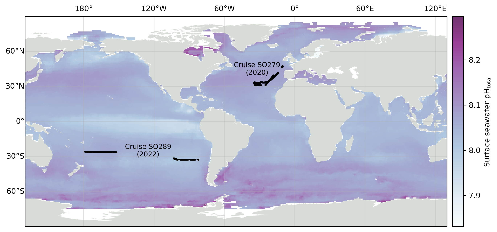

# From small scale variability to mesoscale stability in surface ocean pH: implications for CO2 equilibration

This repository includes the raw data and scripts used to analyze and plot this data for the study:

**From small scale variability to mesoscale stability in surface ocean pH: implications for CO2 equilibration**

*L. Delaigue1, 2\*, G-J Reichart1,3, L. Qiu4,  Eric P. Achterberg4, Y. Ourradi1, C. Galley5,6, A. Mutzberg4,  and M. P. Humphreys1*

1Department of Ocean Systems (OCS), NIOZ Royal Netherlands Institute for Sea Research, PO Box 59, 1790 AB Den Burg (Texel), the Netherlands  
2Sorbonne Université, CNRS, Laboratoire d'Océanographie de Villefranche, LOV, 06230 Villefranche-sur-Mer, France
3Department of Earth Sciences, Utrecht University, Utrecht, the Netherlands  
4GEOMAR Helmholtz Centre for Ocean Research, Kiel, Germany
5Department of Earth Sciences, Memorial University of Newfoundland, St. John's, NL, A1B 3X5, Canada  
6Department of Earth and Environmental Sciences, University of Ottawa, Ottawa, ON, K1N 6N5, Canada  

*Corresponding author: Louise Delaigue ([louise.delaigue@imev-mer.fr](mailto:louise.delaigue@imev-mer.fr))*

## Analysis
To process the data and plot figures as described in the paper, please run the Jupyter notebook named `Code-for-analysis.ipynb`.

Please note that some files are not available due to their large size. Interested readers are encouraged to contact the corresponding author for access.

Please note that the data used here is post-cruise processing, but each cruise's processing can be found in two alternative repositories in Louise Delaigue's profile, with links to download the raw data.

## License
This repository is licensed under the GNU General Public License v3.0 (GPL-3.0), ensuring that the software remains free and open, with the source code available for transparency and modification.
